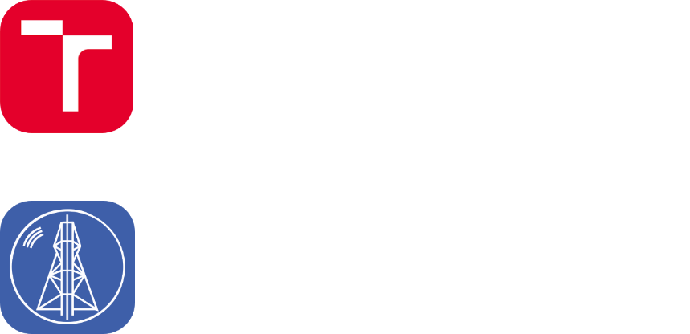

<!-- HEADER -->

<p><a href="https://github.com/nickonegen"></a></p>

<div align="center">
  <h3><a href="https://github.com/nickonegen"></a></h3>

  <p>Hey-o, I’m <strong>Nick <em>Onegen</em></strong>,
a dude who likes computers and
other such things! ^^</p>

  <p><a href="https://code.visualstudio.com/"></a>
<a href="https://github.com/neovim/neovim"></a>
<a href="https://visualstudio.microsoft.com/"></a>
<a href="https://www.arduino.cc/"></a> <br />
<a href="https://endeavouros.com/"></a>
<a href="https://getfedora.org/en/workstation/"></a>
<a href="https://en.wikipedia.org/wiki/Windows_10"></a> <br />
<a href="https://github.com/nickonegen"></a></p>
</div>

<p><a href="https://github.com/nickonegen"></a></p>

<!-- STACK & EDUCATION -->

<p><a href="https://github.com/nickonegen"></a></p>

<div align="left" width="70%">

```javascript
const onegen = {
  name: 'Nick',
  pronouns: [ 'he', 'him' ],
  stack: {
    languages: [ 'JavaScript', 'TypeScript', 'C',
      'C++', 'Rust', 'php', 'Python', 'Bash',
      'VHDL', 'x86' ],
    frontend: [ 'Hugo', 'Tailwind', 'Babel', 'Vue' ],
    backend: [ 'Node', 'Express', 'NestJS', 'NAPI' ],
    science: [ 'MATLAB', 'Jupyter', 'NumPy',
      'SciPy', 'maxima' ],
  },
  code (caffeine) {
    console.log('🦊☕️ Refueling...');
    while (caffeine > 0) {
      console.log('💻🪄 Computer magic...');
      caffeine--;
    }
    console.log('🪫💤 Out of fuel!');
  },
};
```

</div>

<!-- DISCORD -->
<div align="center">

  <h2>What am I up to?</h2>

  <p><a href="https://discord.com/users/258681302960701450"></a></p>

</div>

<div align="center">

  <h3>Projects</h3>

  <table style="width:97%;">
<colgroup>
<col style="width: 23%" />
<col style="width: 19%" />
<col style="width: 21%" />
<col style="width: 32%" />
</colgroup>
<thead>
<tr class="header">
<th style="text-align: center;"><strong>Project</strong></th>
<th style="text-align: center;"><strong>Status</strong></th>
<th style="text-align: center;"><strong>Languages</strong></th>
<th style="text-align: center;"><strong>Description</strong></th>
</tr>
</thead>
<tbody>
<tr class="odd">
<td style="text-align: center;">🔒 <a href="https://github.com/nickonegen/hexxo">Hexxo</a></td>
<td style="text-align: center;"><em>stale, running, rewrite in-progress</em></td>
<td style="text-align: center;">JavaScript<br />
Rust<br />
C++ (legacy)</td>
<td style="text-align: center;">Personal semi–private Discord bot powered by Sapphire/D.JS with music playback, art galleries, stargazing and a medley of random commands</td>
</tr>
<tr class="even">
<td style="text-align: center;">FIT VUT BIT assignments</td>
<td style="text-align: center;"><em>active</em></td>
<td style="text-align: center;"><em>many</em></td>
<td style="text-align: center;">Public archives: <a href="https://github.com/nickonegen/VUT-FIT-IOS2022-projekt1">IOS₁</a> <a href="https://github.com/nickonegen/VUT-FIT-IOS2022-projekt2">IOS₂</a> <a href="https://github.com/nickonegen/VUT-FIT-ISU2022-cvicenia">ISU</a> <a href="https://github.com/nickonegen/VUT-FIT-INC2022-projekt">INC</a> <a href="https://github.com/nickonegen/VUT-FIT-INP2022-projekt1">INP₁</a> <a href="https://github.com/nickonegen/VUT-FIT-INP2022-projekt2">INP₂</a> <a href="https://github.com/nickonegen/VUT-FIT-ISS2022-projekt">ISS</a> <a href="https://github.com/nickonegen/VUT-FIT-IAL2022-ulohy">IAL</a><br />
Private archives: <a href="https://github.com/nickonegen/sukromne/tree/main/archv/VUT-FIT/IEL2021-projekt">IEL</a> <a href="https://github.com/nickonegen/sukromne/tree/main/archv/VUT-FIT/IZP2021-projekt1">IZP₁</a> <a href="https://github.com/nickonegen/sukromne/tree/main/archv/VUT-FIT/IZP2021-projekt2">IZP₂</a> <a href="https://github.com/nickonegen/sukromne/tree/main/archv/VUT-FIT/IUS2021-projekty">IUS</a> <a href="https://github.com/nickonegen/VUT-FIT-IFJ2022-projekt/">IFJ</a></td>
</tr>
<tr class="odd">
<td style="text-align: center;">SPSJM IKT assignments</td>
<td style="text-align: center;"><em>done, archived</em></td>
<td style="text-align: center;"><em>many</em></td>
<td style="text-align: center;">Private archives: <a href="https://github.com/nickonegen/sukromne/tree/main/archv/SPSJM/PRX">PRX</a> <a href="https://github.com/nickonegen/sukromne/tree/main/archv/SPSJM/OSY">OSY</a> <a href="https://github.com/nickonegen/sukromne/tree/main/archv/SPSJM/DAA">DAA</a> <a href="https://github.com/nickonegen/sukromne/tree/main/archv/SPSJM/SXT">SXT</a> <a href="https://github.com/nickonegen/sukromne/tree/main/archv/SPSJM/PAY">PAY</a> <a href="https://github.com/nickonegen/sukromne/tree/main/archv/SPSJM/PRO">PRO</a> <a href="https://github.com/nickonegen/sukromne/tree/main/archv/SPSJM/RPJ">RPJ</a></td>
</tr>
</tbody>
</table>

</div>

<!-- STATS -->
<div align="center">

  <h2>Stats</h2>

  <p><a href="https://github.com/Ashutosh00710/github-readme-activity-graph"></a> <br />
<br />
<a href="https://github.com/anuraghazra/github-readme-stats"></a>
<a href="https://github.com/DenverCoder1/github-readme-streak-stats"></a> <br />
<br />
<a href="https://wakatime.com/"></a>
<a href="https://github.com/ryo-ma/github-profile-trophy"></a></p>

</div>

<!-- IMAGE/LINK DEFINITIONS -->

